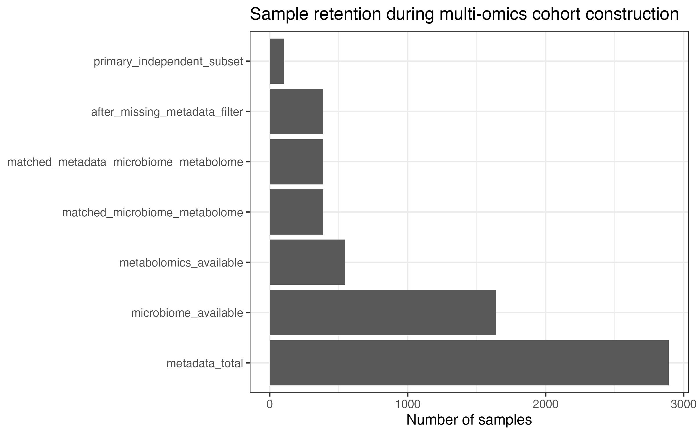
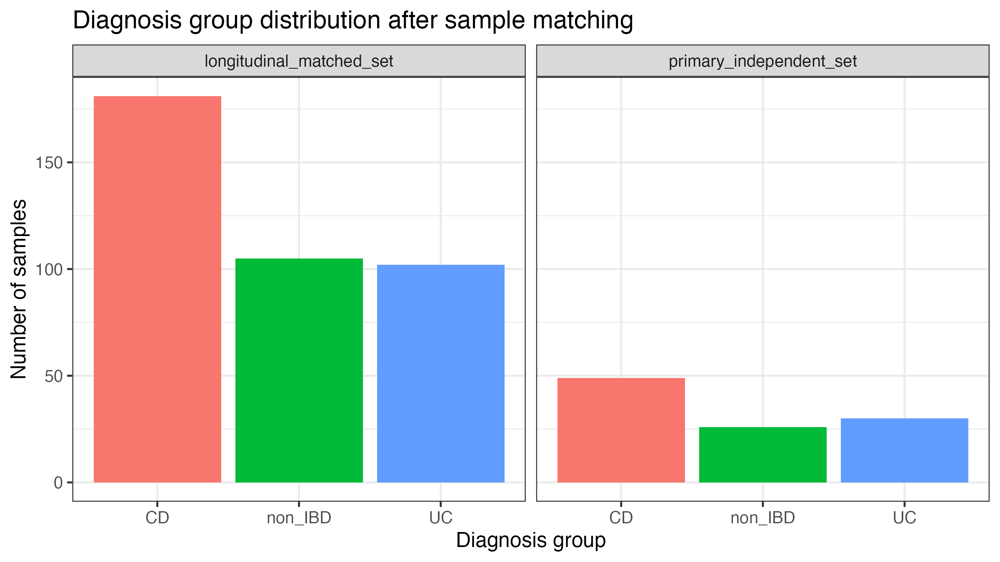
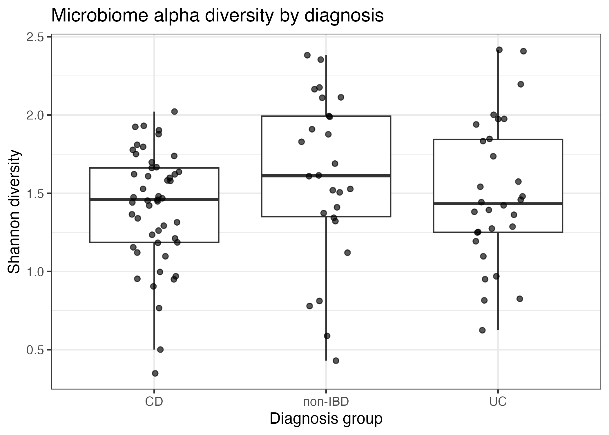
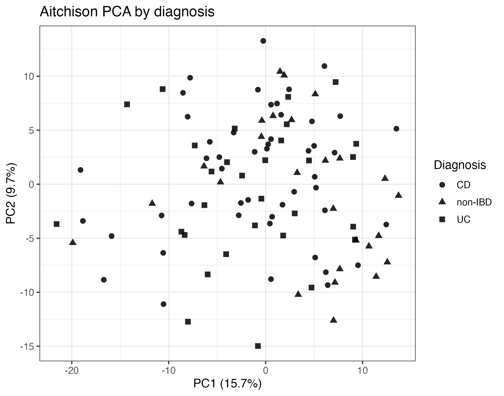
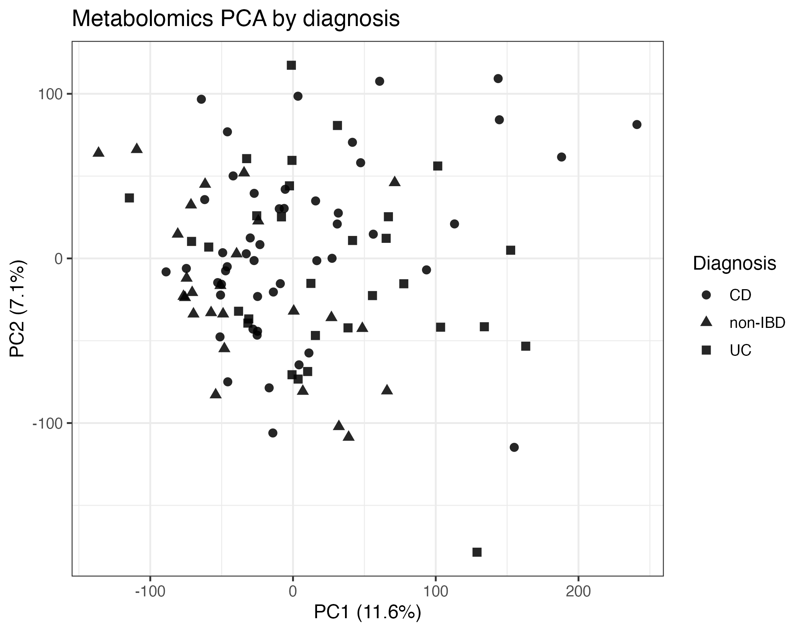
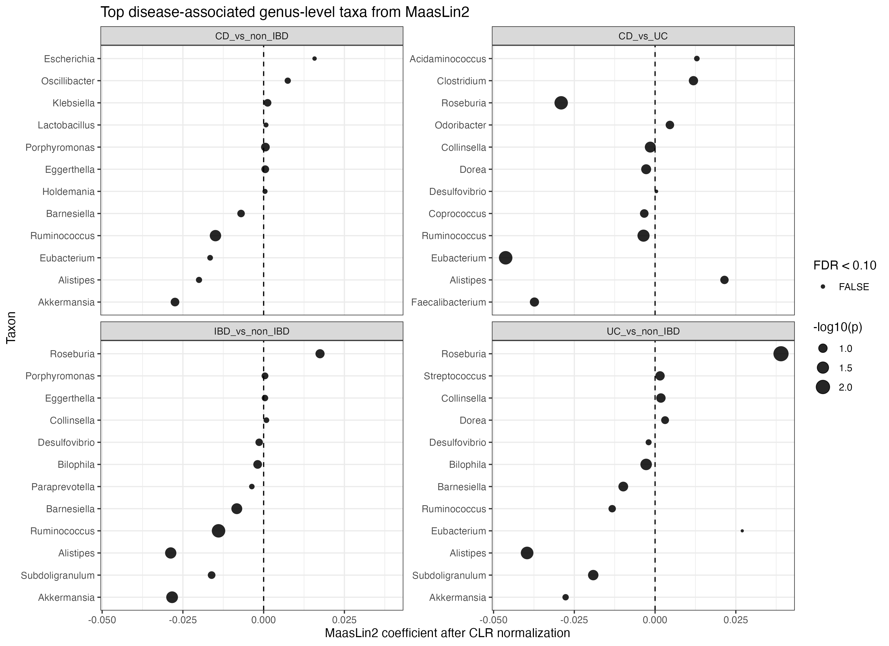
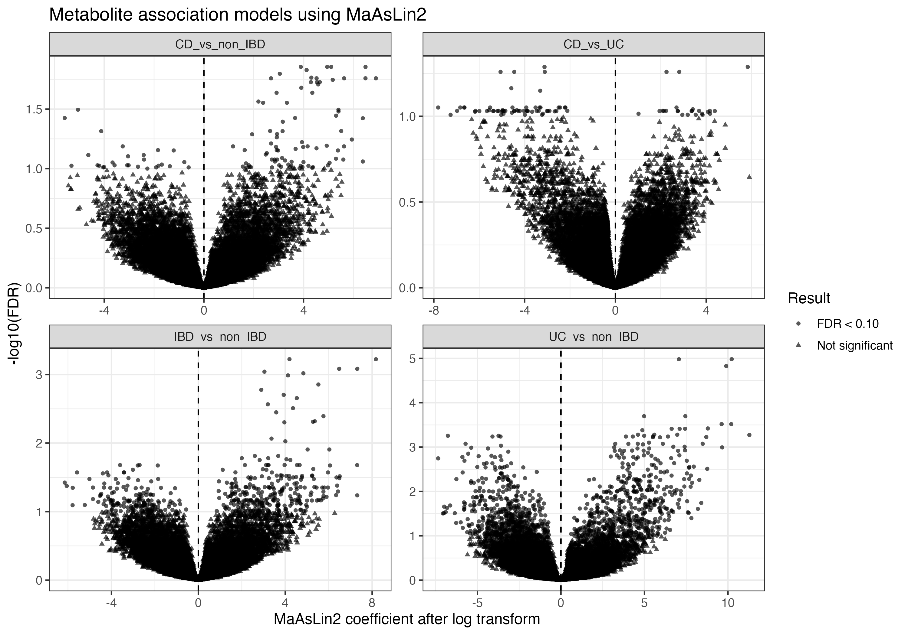
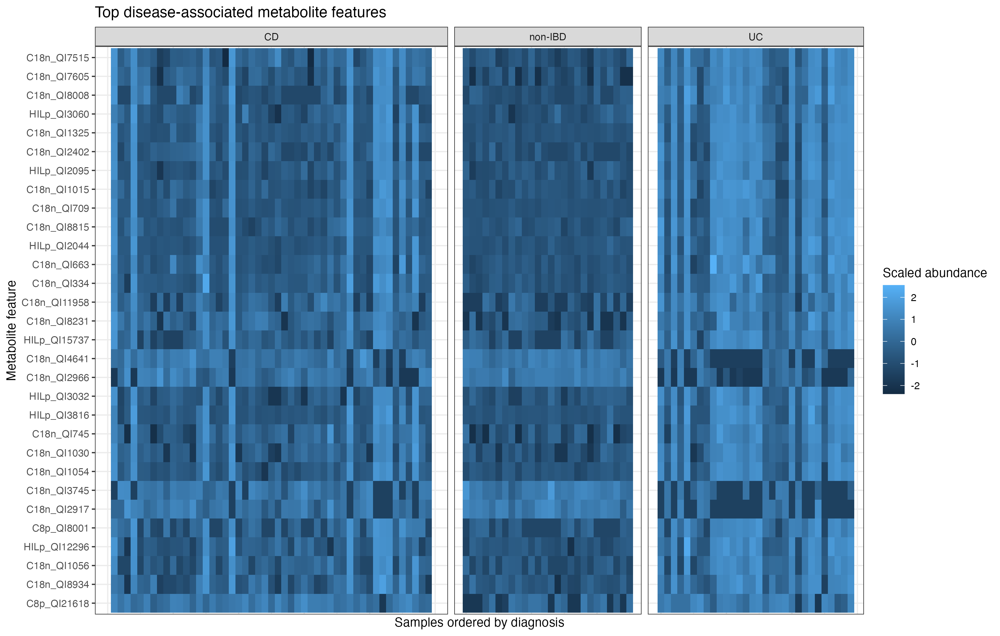
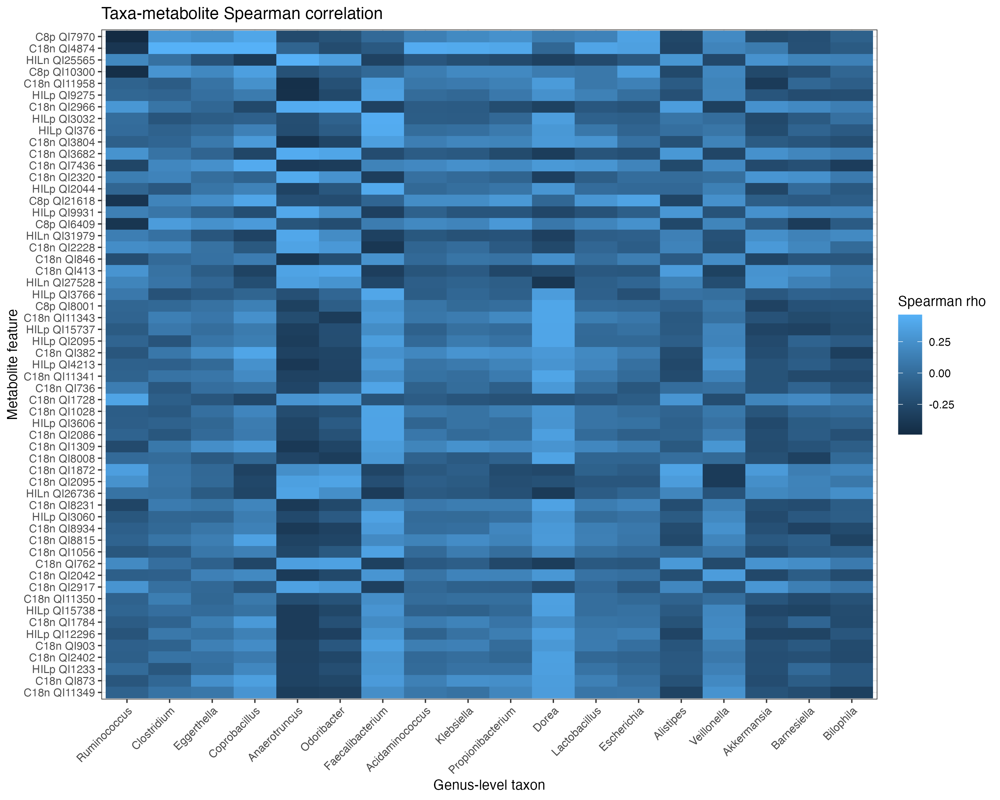
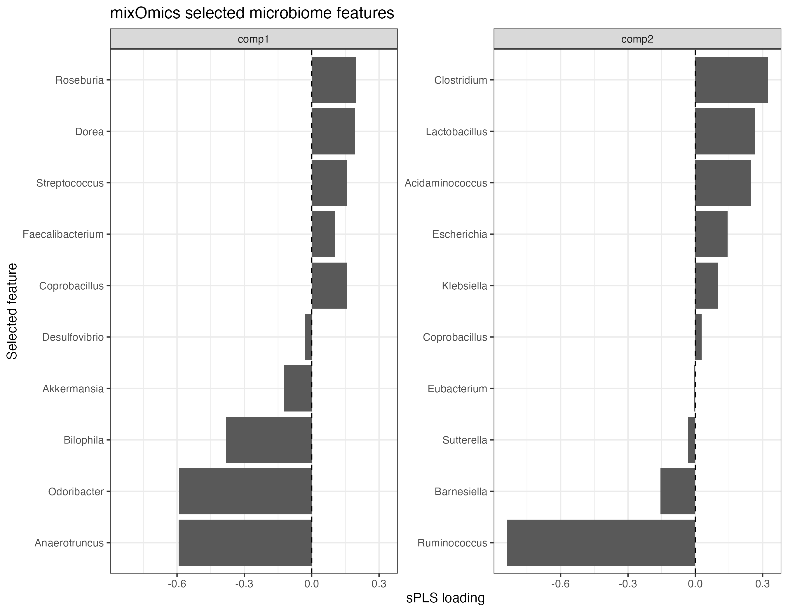

# Microbiome–Metabolome Multi-omics Integration for Exploratory IBD Candidate Biomarker Discovery

A reproducible secondary analysis of paired stool microbiome and metabolomics profiles from the IBDMDB/HMP2 cohort, integrating cohort construction, compositional microbiome analysis, multivariable association modelling, cross-omics correlation, supervised sparse integration, and multi-evidence candidate ranking.

> **Scope:** exploratory candidate biomarker discovery using public processed multi-omics data. The results are not intended as clinical biomarker validation or diagnostic model validation.

**Author:** Ryan Han  
**Analysis environment:** R 4.3.1, MaAsLin2, vegan, mixOmics, Quarto, and renv

[View the analysis source](analysis_report.qmd) ·
[Open the rendered analysis report](analysis_report.html) ·
[Browse final figures](results/final_figures/) ·
[Browse final tables](results/final_tables/)

---

## Project overview

Inflammatory bowel disease includes Crohn's disease (CD) and ulcerative colitis (UC) and is associated with changes across multiple layers of the gut microbial ecosystem. Analysing microbiome and metabolome profiles separately may miss coordinated cross-omics patterns that are relevant to disease state.

This project evaluates whether paired stool microbial taxa and metabolite profiles can identify reproducible, exploratory multi-omics signatures associated with IBD diagnosis. The workflow was designed around a complete research sequence:

```text
public multi-omics data
        ↓
data parsing and sample matching
        ↓
matched longitudinal cohort
        ↓
one-sample-per-participant primary cohort
        ↓
microbiome and metabolome preprocessing
        ↓
single-omics statistical analysis
        ↓
taxa–metabolite correlation
        ↓
sparse supervised multi-omics integration
        ↓
multi-evidence candidate pair ranking
        ↓
reproducible report and curated outputs
```

The emphasis is on transparent cohort construction, appropriate treatment of compositional microbiome data, explicit multiple-testing correction, and cautious interpretation of exploratory candidates.


---

## Research question

Can paired gut microbial taxonomic profiles and stool metabolite features identify exploratory multi-omics candidate signatures associated with IBD diagnosis after:

- matching microbiome, metabolome, and phenotype records at the sample level;
- accounting for repeated sampling in the primary integration dataset;
- applying data-type-specific preprocessing;
- modelling disease associations with available covariates;
- integrating evidence from disease association, cross-omics correlation, and sparse multivariate feature selection?

The primary diagnostic comparisons were:

1. IBD versus non-IBD;
2. CD versus non-IBD;
3. UC versus non-IBD;
4. CD versus UC.

---

## Dataset

Data were obtained from the **Inflammatory Bowel Disease Multi'omics Database / Integrative Human Microbiome Project (IBDMDB/HMP2)**.

The original HMP2 study followed 132 participants longitudinally for approximately one year and generated 2,965 stool, biopsy, and blood specimens across multiple molecular data layers. This project uses public processed stool-derived data rather than raw sequencing reads.

Data layers used here:

| Data layer | Main content |
|---|---|
| Phenotype metadata | Participant identifiers, sample identifiers, diagnosis, sampling information, sex, antibiotic exposure, and available clinical metadata |
| Metagenomic taxonomic profiles | Stool microbial relative-abundance profiles |
| Stool metabolomics | High-dimensional metabolite feature-abundance profiles |

Raw and large processed datasets are not committed to this repository. Data provenance, source information, original file formats, and analysis use are recorded in [`data_manifest.tsv`](data_manifest.tsv).

---

## Cohort construction

Sample matching was treated as a separate analytical stage rather than assuming that metadata, microbiome, and metabolome tables were already aligned.

Matching used available sample-level identifiers, including external/sample identifiers. Participant identifiers and sampling information were retained for repeated-measure checks and construction of the primary independent dataset.

### Sample retention

| Processing stage | Samples | Participants |
|---|---:|---:|
| Metadata records | 2,892 | 131 |
| Microbiome profiles available | 1,638 | 130 |
| Metabolomics profiles available | 546 | 106 |
| Paired microbiome–metabolome samples | 388 | 105 |
| Matched microbiome–metabolome–metadata samples | 388 | 105 |
| After required metadata filtering | 388 | 105 |
| Primary one-sample-per-participant dataset | 105 | 105 |

The complete matched set contained repeated measurements and was retained as a longitudinal resource. The primary ordination, single-omics comparison, cross-omics integration, and candidate-ranking analyses used one matched stool sample per participant to reduce repeated-measure leakage.

The independent sample was selected using the baseline matched sample where available; otherwise, the earliest available matched sampling time was retained.

### Diagnostic composition

| Analysis dataset | CD | UC | non-IBD | Total |
|---|---:|---:|---:|---:|
| Longitudinal matched samples | 181 | 102 | 105 | 388 |
| Unique participants represented | 49 | 30 | 26 | 105 |
| Primary independent samples | 49 | 30 | 26 | 105 |





---

## Analysis workflow

### 1. Metadata parsing and sample matching

Scripts:

```text
R/01_download_data.R
R/02_parse_tables.R
R/03_match_samples_qc.R
```

Main operations:

- download and record public source files;
- parse HMP2 PCL-style tables;
- separate feature matrices from embedded metadata;
- standardise sample and participant identifiers;
- identify sample overlap across all three data layers;
- construct matched longitudinal and independent analysis datasets;
- quantify sample retention and diagnosis-group composition.

Key outputs:

```text
data/processed/metadata_clean.rds
data/processed/matched_metadata.rds
results/tables/sample_matching_flow.tsv
results/tables/group_distribution.tsv
results/figures/sample_matching_flow.png
results/figures/group_distribution_barplot.png
```

Analytical decisions are documented in:

```text
docs/analysis_decisions.md
```

---

### 2. Microbiome preprocessing

Script:

```text
R/04_microbiome_preprocessing.R
```

The primary microbiome analysis used genus-level taxonomic profiles.

Preprocessing included:

- removal of unknown and unclassified taxa;
- prevalence filtering;
- low-abundance filtering;
- addition of a small pseudocount;
- centred log-ratio transformation;
- generation of filtered relative-abundance and CLR matrices.

Filtering criteria:

```text
prevalence ≥ 10%
mean relative abundance ≥ 0.0001
unknown and unclassified taxa removed
```

Final genus-level feature set:

```text
39 genera
```

The CLR representation was used for compositional analyses and multivariable taxon association modelling.

---

### 3. Metabolomics preprocessing

Script:

```text
R/05_metabolome_preprocessing.R
```

Preprocessing included:

- feature-wise missingness assessment;
- removal of features with more than 30% missing values;
- half-minimum imputation within retained metabolite features;
- log2 transformation;
- z-score scaling;
- removal of near-zero-variance features.

Feature retention:

| Processing stage | Metabolite features |
|---|---:|
| Original metabolomics feature matrix | 81,867 |
| After missingness filtering | 40,306 |
| Final log-transformed and scaled matrix | 40,306 |

The processed feature matrix contained 40,306 metabolite features across the 388 matched samples.

Most high-ranking metabolite features remained represented by platform-specific identifiers such as `C18n_QI7605`, `C8p_QI7970`, and `HILp_QI2044`. No confident chemical-name mapping was available for the leading features in the supplied annotation resources; these identifiers are therefore retained rather than assigned speculative metabolite names.

---

### 4. Microbiome diversity and ordination

Script:

```text
R/06_diversity_ordination.R
```

Analyses included:

- observed taxon richness;
- Shannon diversity;
- Bray–Curtis dissimilarity;
- Aitchison distance based on CLR-transformed abundance;
- principal coordinate analysis / principal component ordination;
- PERMANOVA;
- multivariate dispersion testing.

#### Alpha diversity

| Diversity metric | Test | Statistic | p-value | FDR |
|---|---|---:|---:|---:|
| Shannon diversity | Kruskal–Wallis | 3.28 | 0.194 | 0.194 |
| Observed richness | Kruskal–Wallis | 3.84 | 0.146 | 0.194 |

Neither Shannon diversity nor observed richness differed significantly among CD, UC, and non-IBD groups.



#### Beta diversity

| Distance | PERMANOVA R² | F statistic | p-value |
|---|---:|---:|---:|
| Bray–Curtis | 0.0314 | 1.65 | 0.051 |
| Aitchison | 0.0362 | 1.91 | 0.003 |

Aitchison distance detected a statistically significant but modest diagnosis-associated difference in overall microbial composition. Diagnosis explained approximately 3.6% of total CLR-space variation.

The Bray–Curtis result was close to, but did not cross, the conventional 0.05 threshold.

Dispersion tests were not significant:

| Distance | Dispersion-test p-value |
|---|---:|
| Bray–Curtis | 0.967 |
| Aitchison | 0.243 |

The significant Aitchison PERMANOVA result was therefore not accompanied by evidence of diagnosis-specific differences in within-group dispersion.



---

### 5. Metabolomics ordination

Metabolomics principal component analysis was performed on the filtered, log2-transformed, and z-score-scaled metabolite matrix.

The first two components explained:

```text
PC1: 11.6%
PC2: 7.1%
```

Substantial overlap remained among diagnostic groups, with no complete group separation in the first two principal components.



---

### 6. Genus-level differential association analysis

Script:

```text
R/07_differential_abundance_maaslin2.R
```

Genus-level disease associations were evaluated with MaAsLin2 using the primary independent cohort.

Available covariates retained in the fitted models included:

```text
sex
antibiotic exposure
```

Four diagnostic contrasts were evaluated:

```text
IBD versus non-IBD
CD versus non-IBD
UC versus non-IBD
CD versus UC
```

Across 39 genera and four contrasts:

```text
156 taxon-association results
0 associations with FDR < 0.10
```

Several nominal associations were observed, including:

| Genus | Comparison | Effect estimate | p-value | FDR |
|---|---|---:|---:|---:|
| Roseburia | UC versus non-IBD | 0.0390 | 0.00336 | 0.393 |
| Eubacterium | CD versus UC | -0.0463 | 0.00990 | 0.405 |
| Roseburia | CD versus UC | -0.0291 | 0.0104 | 0.405 |
| Ruminococcus | IBD versus non-IBD | -0.0140 | 0.0101 | 0.425 |
| Ruminococcus | CD versus UC | -0.00358 | 0.0218 | 0.484 |

These results are reported as nominal trends only. No individual genus-level association met the predefined FDR threshold, and downstream candidate ranking does not treat these taxa as independently validated disease-associated biomarkers.



---

### 7. Metabolite disease-association analysis

Script:

```text
R/08_metabolite_association_models.R
```

Feature-wise disease-association models were fitted across the 40,306 processed metabolite features.

Total model results:

```text
40,306 metabolite features
× 4 diagnostic contrasts
= 161,224 association results
```

Associations meeting:

```text
FDR < 0.10
```

were retained.

| Diagnostic comparison | FDR-significant metabolite features |
|---|---:|
| UC versus non-IBD | 1,094 |
| IBD versus non-IBD | 442 |
| CD versus non-IBD | 110 |
| CD versus UC | 84 |
| **Total** | **1,730** |

The largest number of metabolite associations was observed for UC versus non-IBD.

The leading statistical signals included platform features such as:

```text
C18n_QI7515
C18n_QI7605
C18n_QI8008
HILp_QI3060
C18n_QI1325
C18n_QI2402
HILp_QI2095
```

Because these identifiers could not be confidently mapped to chemical names using the available platform annotation, biological interpretation is limited to feature-level associations.





---

### 8. Cross-omics feature selection and correlation

Script:

```text
R/09_cross_omics_correlations.R
```

Cross-omics analysis was restricted before correlation testing to avoid an indiscriminate all-by-all analysis.

Selected inputs:

| Feature block | Available features | Features used |
|---|---:|---:|
| Genus-level microbiome | 39 | 39 |
| Metabolomics | 40,306 | 100 |

Because no genus survived FDR correction, all 39 filtered genera were retained and prioritised by absolute MaAsLin2 effect size. Metabolite features were prioritised using disease-association FDR and effect-size evidence and capped at 100 features.

Pairwise Spearman correlations were calculated using the 105-sample independent dataset.

Number of tested feature pairs:

```text
39 taxa × 100 metabolite features = 3,900 pairs
```

Retention criteria:

```text
absolute Spearman rho ≥ 0.30
Benjamini–Hochberg FDR < 0.10
```

Results:

```text
230 significant taxa–metabolite pairs
```

Leading correlations included:

| Taxon | Metabolite feature | Spearman rho | Correlation FDR |
|---|---|---:|---:|
| Ruminococcus | C8p_QI7970 | -0.490 | 0.000452 |
| Clostridium | C18n_QI4874 | 0.464 | 0.000587 |
| Eggerthella | C18n_QI4874 | 0.463 | 0.000587 |
| Coprobacillus | C18n_QI4874 | 0.462 | 0.000587 |
| Anaerotruncus | HILn_QI25565 | 0.459 | 0.000587 |
| Ruminococcus | C8p_QI10300 | -0.458 | 0.000587 |
| Anaerotruncus | C18n_QI11958 | -0.450 | 0.000818 |
| Anaerotruncus | HILp_QI9275 | -0.444 | 0.00104 |
| Odoribacter | C18n_QI2966 | 0.440 | 0.00113 |
| Faecalibacterium | HILp_QI3032 | 0.434 | 0.00143 |

Residual-based covariate-adjusted correlations were additionally generated as a sensitivity analysis and are available in:

```text
results/final_tables/source_covariate_adjusted_correlation_pairs.tsv
```

Correlation indicates coordinated variation and should not be interpreted as a causal or mechanistic relationship.



---

### 9. Sparse supervised multi-omics integration

Script:

```text
R/10_spls_mixomics_integration.R
```

A supervised block sparse PLS-DA model was fitted with mixOmics using the primary one-sample-per-participant cohort.

Model specification:

| Parameter | Value |
|---|---:|
| Samples | 105 |
| Outcome | Diagnosis |
| Components | 2 |
| Microbiome features supplied | 39 |
| Metabolite features supplied | 100 |
| Microbiome features retained per component | 10, 10 |
| Metabolite features retained per component | 25, 25 |

The largest absolute microbial loadings included:

| Component | Taxon | Loading |
|---|---|---:|
| Component 1 | Anaerotruncus | -0.593 |
| Component 1 | Odoribacter | -0.592 |
| Component 1 | Bilophila | -0.382 |
| Component 1 | Roseburia | 0.196 |
| Component 1 | Dorea | 0.193 |
| Component 2 | Ruminococcus | -0.840 |
| Component 2 | Clostridium | 0.325 |
| Component 2 | Lactobacillus | 0.266 |
| Component 2 | Acidaminococcus | 0.246 |
| Component 2 | Barnesiella | -0.156 |

The apparent nearest-centroid accuracy calculated on integrated training scores was:

```text
0.733
```

This is an exploratory training-set metric. It is not cross-validated performance, external validation, or evidence of clinical diagnostic accuracy.

The sPLS model was used to identify coordinated multi-omics features and contribute feature-loading evidence to candidate ranking, not to claim a validated classifier.



---

## Multi-evidence candidate biomarker ranking

Script:

```text
R/11_biomarker_ranking.R
```

Candidate taxa–metabolite pairs were ranked using multiple evidence layers rather than p-value alone.

Evidence incorporated into the ranking included:

- genus-level disease-association effect;
- genus-level association FDR;
- metabolite disease-association effect;
- metabolite association FDR;
- taxa–metabolite correlation magnitude;
- correlation FDR;
- sparse PLS loading magnitude;
- feature prevalence or missingness robustness;
- annotation and biological interpretability where available.

A total of:

```text
230 candidate taxa–metabolite pairs
```

were ranked.

### Top-ranked exploratory candidate pairs

| Rank | Taxon | Metabolite feature | Taxon FDR | Metabolite FDR | Spearman rho | Correlation FDR | sPLS loading | Overall score |
|---:|---|---|---:|---:|---:|---:|---:|---:|
| 1 | Ruminococcus | C8p_QI7970 | 0.425 | 0.00198 | -0.490 | 0.000452 | 0.840 | 0.634 |
| 2 | Ruminococcus | C8p_QI10300 | 0.425 | 0.00167 | -0.458 | 0.000587 | 0.840 | 0.582 |
| 3 | Faecalibacterium | C18n_QI7605 | 0.718 | 0.0000105 | 0.322 | 0.0219 | 0.140 | 0.582 |
| 4 | Ruminococcus | C8p_QI21618 | 0.425 | 0.000824 | -0.408 | 0.00311 | 0.840 | 0.572 |
| 5 | Faecalibacterium | HILp_QI2044 | 0.718 | 0.000386 | 0.412 | 0.00264 | 0.164 | 0.568 |
| 6 | Dorea | C18n_QI8008 | 0.640 | 0.0000149 | 0.374 | 0.00648 | 0.305 | 0.558 |
| 7 | Faecalibacterium | HILp_QI3032 | 0.718 | 0.000556 | 0.434 | 0.00143 | 0.104 | 0.554 |
| 8 | Ruminococcus | C8p_QI6409 | 0.425 | 0.000959 | -0.404 | 0.00349 | 0.840 | 0.535 |
| 9 | Anaerotruncus | C18n_QI11958 | 0.702 | 0.000526 | -0.450 | 0.000818 | 0.593 | 0.532 |
| 10 | Anaerotruncus | C18n_QI3804 | 0.702 | 0.00102 | -0.426 | 0.00156 | 0.593 | 0.527 |

The ranking is primarily supported by metabolite disease associations, cross-omics correlation, and sPLS selection. The taxon FDR values in the table remain above 0.10, consistent with the absence of FDR-significant individual genera.

The top-ranked pairs should therefore be interpreted as **cross-omics hypotheses for follow-up**, not confirmed microbial or clinical biomarkers.


---

## Main findings

1. **A rigorously matched multi-omics cohort was constructed.**  
   Matching reduced 2,892 metadata records to 388 paired microbiome–metabolome samples from 105 participants. A one-sample-per-participant dataset was used for primary integration to avoid treating repeated samples as independent observations.

2. **Diagnosis was associated with a modest shift in overall microbiome composition.**  
   Aitchison PERMANOVA was significant (`R² = 0.0362`, `p = 0.003`) without evidence of unequal multivariate dispersion. The effect size was small, indicating substantial within-group heterogeneity.

3. **No individual genus survived multiple-testing correction.**  
   Although several nominal genus-level associations were observed, none reached `FDR < 0.10`. Taxon-level findings are therefore not presented as independently significant disease markers.

4. **Metabolite features showed stronger disease-associated signals.**  
   A total of 1,730 metabolite-feature associations met `FDR < 0.10`, with the largest number observed in UC versus non-IBD.

5. **Cross-omics integration identified coordinated microbial–metabolite patterns.**  
   Among 3,900 selected feature pairs, 230 met the predefined correlation threshold. Ruminococcus, Faecalibacterium, Anaerotruncus, Dorea, Clostridium, Odoribacter, and related genera contributed to leading cross-omics signals.

6. **The final ranking integrates evidence rather than relying on a single p-value.**  
   Candidate pairs were prioritised by disease association, correlation strength, multiple-testing evidence, sPLS loading, and feature robustness.

7. **The results remain exploratory.**  
   Metabolite identities are largely unresolved, individual taxon associations did not survive FDR correction, and the supervised integration metric is training-set apparent performance only.

---

## Repository structure

```text
microbiome-metabolome-ibd-biomarkers/
├── README.md
├── analysis_report.qmd
├── analysis_report.html
├── data_manifest.tsv
├── renv.lock
├── .Rprofile
├── .gitignore
│
├── R/
│   ├── 00_utils_io.R
│   ├── 01_download_data.R
│   ├── 02_parse_tables.R
│   ├── 03_match_samples_qc.R
│   ├── 04_microbiome_preprocessing.R
│   ├── 05_metabolome_preprocessing.R
│   ├── 06_diversity_ordination.R
│   ├── 07_differential_abundance_maaslin2.R
│   ├── 08_metabolite_association_models.R
│   ├── 09_cross_omics_correlations.R
│   ├── 10_spls_mixomics_integration.R
│   ├── 11_biomarker_ranking.R
│   └── 12_make_figures_tables.R
│
├── data/
│   ├── raw/
│   │   └── .gitkeep
│   ├── processed/
│   │   └── .gitkeep
│   └── metadata/
│
├── results/
│   ├── final_figures/
│   ├── final_tables/
│   ├── figures/
│   ├── tables/
│   └── models/
│
├── docs/
│   ├── analysis_decisions.md
│   └── data_dictionary.md
│
└── renv/
    ├── activate.R
    └── settings.json
```

Large source data, processed R objects, and regenerable model-intermediate files are intentionally excluded from version control.

---

## Key outputs

### Final figures

The curated figure set is available in:

```text
results/final_figures/
```

| Figure | Description |
|---:|---|
| 1 | Study workflow |
| 2 | Sample matching and retention |
| 3 | Diagnosis distribution in matched datasets |
| 4 | Microbiome alpha diversity |
| 5 | Microbiome beta-diversity ordination |
| 6 | Metabolomics PCA |
| 7 | Genus-level MaAsLin2 association results |
| 8 | Metabolite disease-association results |
| 9 | Top metabolite-feature heatmap |
| 10 | Taxa–metabolite correlation heatmap |
| 11 | mixOmics selected-feature loadings |
| 12 | Final candidate taxa–metabolite ranking |

### Final tables

The curated tables are available in:

```text
results/final_tables/
```

Selected outputs include:

```text
table_01_key_project_numbers.tsv
table_02_group_distribution.tsv
table_07_top_candidate_biomarker_pairs.tsv

source_sample_matching_flow.tsv
source_alpha_diversity_results.tsv
source_permanova_results.tsv
source_betadisper_results.tsv
source_maaslin2_taxa_all_results.tsv
source_maaslin2_taxa_significant_results.tsv
source_metabolite_association_significant_results.tsv
source_integration_feature_selection_summary.tsv
source_taxa_metabolite_spearman_significant_pairs.tsv
source_covariate_adjusted_correlation_pairs.tsv
source_mixomics_selected_microbiome_features.tsv
source_mixomics_selected_metabolite_features.tsv
source_mixomics_model_performance.tsv
source_final_candidate_biomarker_ranking.tsv
source_final_candidate_biomarker_ranking_annotated.tsv
```

---

## Reproducibility

The project uses `renv` to record the R package environment and Quarto to generate the analysis report.

### Requirements

- R 4.3 or later;
- Quarto command-line installation;
- internet access for downloading public source data and restoring R packages.

### Clone the repository

```bash
git clone https://github.com/Ryan-Han-RY/microbiome-metabolome-ibd-biomarkers.git

cd microbiome-metabolome-ibd-biomarkers
```

### Restore the R environment

Start R from the repository root and run:

```r
if (!requireNamespace("renv", quietly = TRUE)) {
  install.packages("renv")
}

renv::restore()
```

### Run the analysis

Scripts are organised in analytical order:

```r
source("R/00_utils_io.R")

source("R/01_download_data.R")
source("R/02_parse_tables.R")
source("R/03_match_samples_qc.R")

source("R/04_microbiome_preprocessing.R")
source("R/05_metabolome_preprocessing.R")
source("R/06_diversity_ordination.R")

source("R/07_differential_abundance_maaslin2.R")
source("R/08_metabolite_association_models.R")

source("R/09_cross_omics_correlations.R")
source("R/10_spls_mixomics_integration.R")
source("R/11_biomarker_ranking.R")

source("R/12_make_figures_tables.R")
```

### Render the analysis report

```r
quarto::quarto_render("analysis_report.qmd")
```

The rendered report is written to:

```text
analysis_report.html
```

---

## Data availability

The analysis uses public processed IBDMDB/HMP2 resources.

Large raw and processed datasets are excluded from the GitHub repository. The repository instead provides:

- scripted data acquisition and parsing;
- a data manifest;
- processing code;
- curated result tables;
- final figures;
- a rendered analytical report;
- an `renv.lock` dependency record.

Source-data details are documented in:

```text
data_manifest.tsv
```

The project does not perform raw FASTQ preprocessing, read-level quality control, taxonomic profiling from sequencing reads, or metabolomics peak calling.

---

## Limitations

Several limitations affect interpretation:

1. **Processed public data**  
   The project begins with public processed taxonomic and metabolite-feature tables rather than raw sequencing or mass-spectrometry files. Upstream processing decisions could not be independently re-evaluated.

2. **Primary cross-sectional integration**  
   Although 388 longitudinal matched samples were retained, the primary integration analysis used one sample per participant. This reduces repeated-measure leakage but does not model within-participant temporal trajectories.

3. **Moderate independent sample size**  
   The primary cohort contained 105 participants, including 49 CD, 30 UC, and 26 non-IBD participants.

4. **No FDR-significant individual genera**  
   Genus-level MaAsLin2 associations did not survive multiple-testing correction. Taxa appearing in the final ranking are supported by cross-omics and multivariate evidence rather than significant independent taxon associations.

5. **Incomplete metabolite annotation**  
   Leading metabolite features remained platform-specific identifiers. Chemical identity, pathway membership, and biological mechanism cannot be inferred reliably without additional annotation or experimental confirmation.

6. **Exploratory supervised model**  
   The reported mixOmics accuracy is an apparent training-set metric. No nested cross-validation, held-out test cohort, or external validation was used.

7. **Candidate ranking is not clinical validation**  
   The final score is a transparent multi-evidence prioritisation framework. It does not estimate diagnostic sensitivity, specificity, clinical utility, or causal relevance.

---

## Skills demonstrated

- public multi-omics data acquisition and provenance tracking;
- PCL-style table parsing;
- messy metadata harmonisation;
- sample-level microbiome–metabolome matching;
- longitudinal cohort awareness;
- construction of an independent participant-level analysis set;
- microbiome prevalence and abundance filtering;
- compositional microbiome analysis;
- pseudocount handling and CLR transformation;
- Shannon diversity and observed richness analysis;
- Bray–Curtis and Aitchison ordination;
- PERMANOVA and multivariate dispersion testing;
- metabolomics missingness filtering and imputation;
- log transformation and feature scaling;
- MaAsLin2 multivariable association modelling;
- Benjamini–Hochberg FDR correction;
- feature-prioritised cross-omics correlation;
- covariate-adjusted correlation sensitivity analysis;
- mixOmics block sparse PLS-DA;
- multi-evidence candidate biomarker ranking;
- reproducible R project organisation;
- Quarto analytical reporting;
- dependency management with renv;
- Git and GitHub version control.

---

## References

1. Lloyd-Price J, Arze C, Ananthakrishnan AN, et al. **Multi-omics of the gut microbial ecosystem in inflammatory bowel diseases.** *Nature*. 2019;569:655–662.  
   https://doi.org/10.1038/s41586-019-1237-9

2. Mallick H, Rahnavard A, McIver LJ, et al. **Multivariable association discovery in population-scale meta-omics studies.** *PLoS Computational Biology*. 2021;17(11):e1009442.  
   https://doi.org/10.1371/journal.pcbi.1009442

3. Rohart F, Gautier B, Singh A, Lê Cao KA. **mixOmics: An R package for 'omics feature selection and multiple data integration.** *PLoS Computational Biology*. 2017;13(11):e1005752.  
   https://doi.org/10.1371/journal.pcbi.1005752

4. IBDMDB/HMP2 data resource.  
   https://ibdmdb.org/

5. MaAsLin2 documentation.  
   https://huttenhower.sph.harvard.edu/maaslin2/

6. mixOmics documentation.  
   https://mixomics.org/

7. Quarto documentation.  
   https://quarto.org/

8. renv documentation.  
   https://rstudio.github.io/renv/