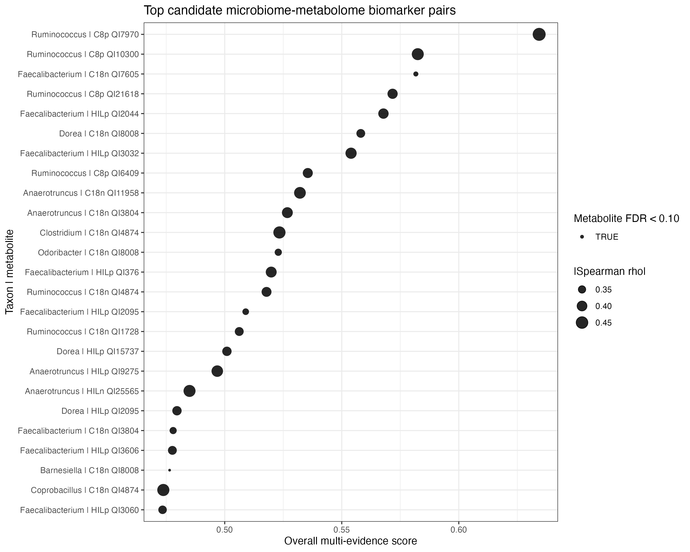

# Microbiome–Metabolome Integration for Exploratory IBD Candidate Prioritisation

[](https://www.r-project.org/)
[](https://huttenhower.sph.harvard.edu/maaslin2/)
[](https://mixomics.org/)
[](https://rstudio.github.io/renv/)

A reproducible secondary analysis of paired stool microbiome and metabolomics profiles from the IBDMDB/HMP2 cohort. The project focuses on transparent cohort construction, data-type-specific preprocessing, diagnosis-associated single-omics signals, cross-omics correlation, sparse multivariate integration, and evidence-based prioritisation of exploratory taxa–metabolite candidate pairs.

> **Scope:** exploratory candidate discovery from public processed data. The outputs are not clinically validated biomarkers and the supervised model is not a validated diagnostic classifier.

**Author:** Ryan Han  
**Rendered report:** [View the full Quarto analysis report](https://ryan-han-ry.github.io/microbiome-metabolome-ibd-biomarkers/analysis_report.html)  
**Report source:** [`analysis_report.qmd`](analysis_report.qmd)  
**Curated outputs:** [Figures](results/final_figures/) · [Tables](results/final_tables/)

---

## Research question

Can paired gut microbial taxonomic profiles and stool metabolite features reveal coordinated multi-omics signatures associated with IBD diagnosis after rigorous sample matching, compositional microbiome preprocessing, covariate-aware association modelling, and participant-level integration?

The primary comparisons were:

- IBD vs non-IBD
- CD vs non-IBD
- UC vs non-IBD
- CD vs UC

---

## Study design


The analysis used two related datasets:

- **Longitudinal matched set:** 388 paired microbiome–metabolome samples from 105 participants, retained for repeated-measure-aware resources and sensitivity work.
- **Primary independent set:** one matched stool sample per participant (105 samples), used for ordination, single-omics association testing, cross-omics integration, and candidate ranking to avoid treating repeated samples as independent observations.

| Cohort metric | Value |
|---|---:|
| Metadata records screened | 2,892 |
| Paired microbiome–metabolome samples | 388 |
| Participants with matched data | 105 |
| Primary independent samples | 105 |
| CD / UC / non-IBD participants | 49 / 30 / 26 |
| Genus-level features retained | 39 |
| Metabolite features retained | 40,306 |

---

## Analysis workflow

1. **Data provenance and parsing**  
   Downloaded public IBDMDB/HMP2 metadata, taxonomic profiles, and stool metabolomics tables; recorded sources and file metadata in `data_manifest.tsv`.

2. **Sample matching and cohort construction**  
   Harmonised sample identifiers across data layers, quantified retention, retained the complete longitudinal matched set, and created a one-sample-per-participant primary cohort.

3. **Microbiome preprocessing**  
   Removed unknown/unclassified taxa, applied prevalence and mean-abundance filters, added a pseudocount, and generated centred log-ratio (CLR) representations.

4. **Metabolomics preprocessing**  
   Removed features with >30% missingness, applied half-minimum imputation, log2 transformation, z-score scaling, and near-zero-variance filtering.

5. **Single-omics analyses**  
   Evaluated alpha diversity, Bray–Curtis and Aitchison ordination, PERMANOVA, multivariate dispersion, genus-level MaAsLin2 models, and feature-wise metabolite association models.

6. **Cross-omics integration**  
   Prioritised 39 taxa and 100 metabolite features, tested Spearman associations with FDR correction, and performed a residual-based covariate-adjusted sensitivity analysis.

7. **Sparse multivariate feature selection**  
   Used a two-component mixOmics block sPLS-DA model as an exploratory feature-selection approach.

8. **Candidate prioritisation**  
   Ranked taxa–metabolite pairs using disease-association evidence, correlation strength, FDR, sparse-model loadings, and feature robustness.

---

## Main findings

- **Cohort construction was the main analytical bottleneck.** Matching reduced 2,892 metadata records to 388 paired multi-omics samples from 105 participants; the primary analysis used one sample per participant.

- **Microbiome alpha diversity did not differ significantly by diagnosis.** Shannon diversity and observed richness had FDR-adjusted values of 0.194.

- **Overall microbiome composition showed a modest diagnosis-associated shift in CLR space.** Aitchison PERMANOVA gave `R² = 0.0362` and `p = 0.003`, with no evidence of unequal multivariate dispersion (`p = 0.243`). Bray–Curtis PERMANOVA was borderline (`R² = 0.0314`, `p = 0.051`).

- **No individual genus survived multiple-testing correction.** Across 39 genera and four contrasts, none met `FDR < 0.10`; nominal taxon trends are therefore not presented as independently significant biomarkers.

- **Metabolite features showed stronger diagnosis-associated signals.** A total of 1,730 feature-level associations met `FDR < 0.10`, most frequently in UC vs non-IBD.

- **Cross-omics analysis identified 230 significant taxa–metabolite pairs** meeting `|rho| >= 0.30` and correlation `FDR < 0.10` among 3,900 tested pairs.

- **The leading ranked pair was `Ruminococcus–C8p_QI7970`** (`rho = -0.490`, correlation FDR `= 0.000452`, overall score `= 0.634`). The metabolite remains a platform-specific feature without a confident chemical annotation.

- **The mixOmics result is exploratory.** The apparent nearest-centroid accuracy on training scores was 0.733; this is not cross-validated or externally validated performance.



---

## Repository structure

```text
microbiome-metabolome-ibd-biomarkers/
├── README.md
├── analysis_report.qmd
├── analysis_report.html
├── data_manifest.tsv
├── renv.lock
├── R/
│   ├── 00_utils_io.R
│   ├── 01_download_data.R
│   ├── 02_parse_tables.R
│   ├── 03_match_samples_qc.R
│   ├── 04_microbiome_preprocessing.R
│   ├── 05_metabolome_preprocessing.R
│   ├── 06_diversity_ordination.R
│   ├── 07_differential_abundance_maaslin2.R
│   ├── 08_metabolite_association_models.R
│   ├── 09_cross_omics_correlations.R
│   ├── 10_spls_mixomics_integration.R
│   ├── 11_biomarker_ranking.R
│   └── 12_make_figures_tables.R
├── data/
│   ├── raw/
│   ├── processed/
│   └── metadata/
├── results/
│   ├── final_figures/
│   ├── final_tables/
│   ├── figures/
│   ├── tables/
│   └── models/
└── docs/
    ├── analysis_decisions.md
    └── data_dictionary.md
```

Large source files, processed R objects, and regenerable model intermediates are intentionally excluded from version control.

---

## Reproducibility

### 1. Clone the repository

```bash
git clone https://github.com/Ryan-Han-RY/microbiome-metabolome-ibd-biomarkers.git
cd microbiome-metabolome-ibd-biomarkers
```

### 2. Restore the R environment

Open the R project and run:

```r
if (!requireNamespace("renv", quietly = TRUE)) {
  install.packages("renv")
}
renv::restore()
```

### 3. Run the analysis

Scripts are numbered in analytical order. Run them from the repository root:

```r
source("R/01_download_data.R")
source("R/02_parse_tables.R")
source("R/03_match_samples_qc.R")
source("R/04_microbiome_preprocessing.R")
source("R/05_metabolome_preprocessing.R")
source("R/06_diversity_ordination.R")
source("R/07_differential_abundance_maaslin2.R")
source("R/08_metabolite_association_models.R")
source("R/09_cross_omics_correlations.R")
source("R/10_spls_mixomics_integration.R")
source("R/11_biomarker_ranking.R")
source("R/12_make_figures_tables.R")
```

### 4. Render the report

```bash
quarto render analysis_report.qmd --to html
```

The rendered report is written to `analysis_report.html`.

---

## Data availability

The project uses public processed IBDMDB/HMP2 resources. Raw sequencing reads and raw mass-spectrometry data are not analysed. Data provenance, download information, formats, and analysis use are recorded in [`data_manifest.tsv`](data_manifest.tsv).

---

## Interpretation limits

The candidate ranking is a transparent exploratory prioritisation framework, not clinical validation. Most leading metabolite features lack confident chemical identities, no individual genus passed the predefined FDR threshold, and the supervised integration metric was calculated on the training data. External cohorts and targeted metabolite annotation are required before biological or diagnostic claims can be made.

---

## Methods and tools

R · tidyverse · vegan · MaAsLin2 · mixOmics · CLR transformation · Aitchison distance · PERMANOVA · Benjamini–Hochberg FDR correction · Quarto · renv · Git/GitHub

---

## Citation

Primary data resource:

Lloyd-Price J, Arze C, Ananthakrishnan AN, et al. *Multi-omics of the gut microbial ecosystem in inflammatory bowel diseases.* Nature. 2019;569:655–662. https://doi.org/10.1038/s41586-019-1237-9
